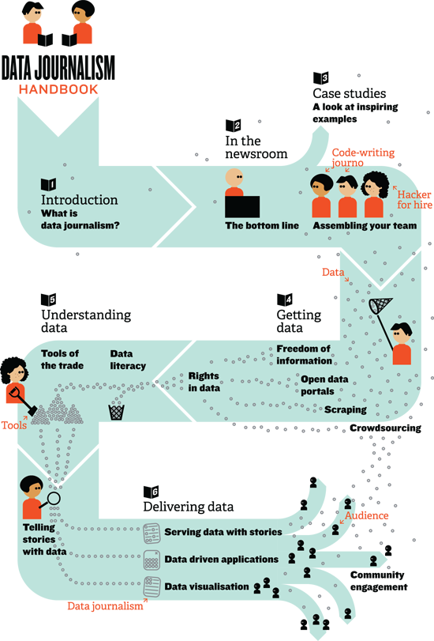

!SLIDE
# Jornalismo de dados e Software Livre #

!SLIDE bullets

* http://datajournalismhandbook.org/
* http://opendatahandbook.org/
* http://www.niemanlab.org/2012/09/brian-boyer-welcome-to-hacker-journalism-101-take-your-seats/

!SLIDE smallquote

Quando a informação era escassa, a maior parte dos nossos esforços se
dedicavam a caçar e coletar. Agora que a informação é abundante,
processar é mais importante. Nós processamos em dois níveis:

1. análise para extrair sentido e estrutura do fluxo interminável de
   dados
2. apresentações para levar o que há de mais importante e relevante
   para a cabeça do leitor

Como a ciência, o jornalismo de dados informa seus métodos e apresenta
seus achados de forma a que possam ser verificados por replicação.

*Philip Meyer, University of North Carolina at Chapel Hill*

!SLIDE center

!SLIDE bullets
# Pegando Dados #
* Datahub / Datacatalogs
* Archive.org
* Scraperwiki / Scrapy

!SLIDE bullets
# Enriquecendo os Dados #
* OpenCalais
* Managing News
* Ushahidi / Swiftriver

!SLIDE bullets
# Entendendo os Dados #
* CSV Kit
* Google Refine
* GeoDjango

!SLIDE bullets
# Apresentando os Dados #
* R
* Tilemill / Mapbox
* Web

!SLIDE bullets
# Dados para Hackers #
* DB
* API
* CKAN

!SLIDE
# Capi Etheriel #
* barraponto @ {IRC, Gmail, Twitter, Github}
* barraponto.blog.br
